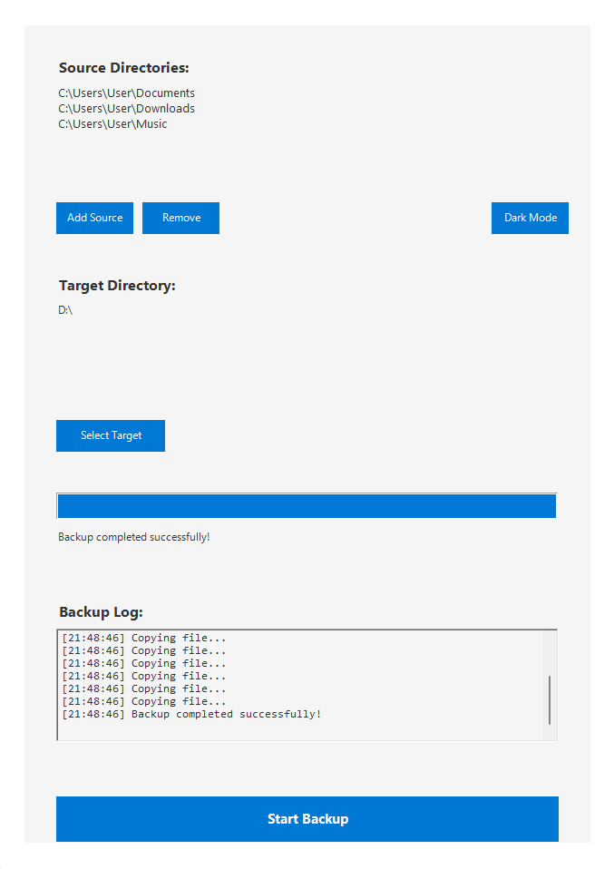
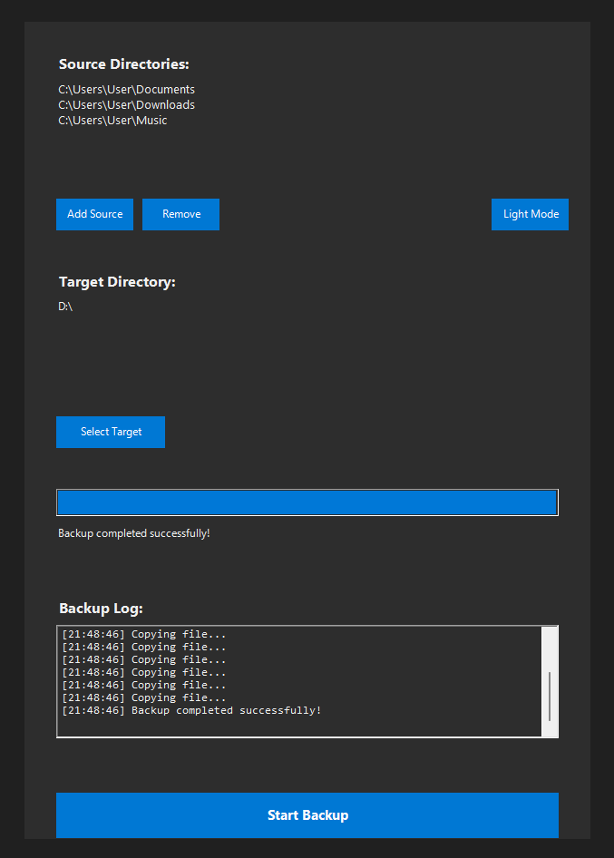

# BackupBuddy v1.0


A user-friendly PowerShell GUI tool for Windows backup management.

## 📸 Preview

### Light Mode


### Dark Mode


## 🔥 Core Features

- 📁 **Multiple Source Directories**
  - Add multiple backup sources
  - Easy directory management
  - Visual directory listing

- 💾 **Smart Backup Engine**
  - Intelligent file comparison
  - Large file optimization
  - Progress tracking with speed info

- 🎨 **User Interface**
  - Dark/Light mode support
  - Progress visualization
  - Real-time status updates
  - Detailed backup logging
 
## ⚡ Quick Start

Open PowerShell and run:

```irm https://raw.githubusercontent.com/HerrTaeubler/BackupBuddy/main/Start-BackupBuddy.ps1 | iex```

### Alternative Method 1: Batch File
1. Download [BackupBuddy.bat](BackupBuddy.bat)
2. Double-click to run

### Alternative Method 2: PowerShell Script
1. Download [Start-BackupBuddy.ps1](Start-BackupBuddy.ps1)
2. Right-click and "Run with PowerShell"

## 📝 Configuration Details

- Settings stored in `%AppData%\BackupBuddy`
- Persistent source/target directories
- Theme preference memory


## 👨‍💻 Author

Herr Täubler

## ⚠️ Disclaimer

While this tool is designed to be safe and user-friendly, always ensure you have proper backups before starting. Use at your own risk.

## 🤝 Support

For issues, questions, or suggestions:
- Open an issue on GitHub
- Submit a pull request
- Contact via GitHub

## 📜 License

MIT License - See LICENSE file for details
